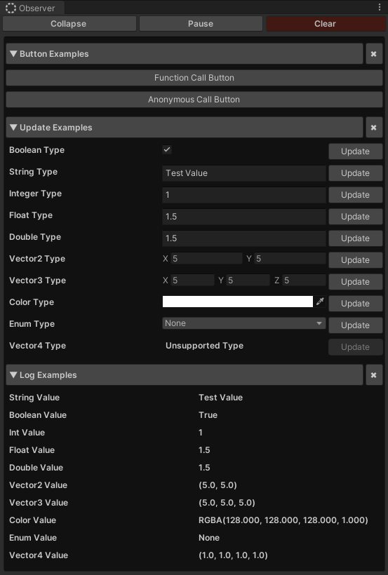

# Observer
### Observer Editor Tool

An editor window to invoke methods, observe values and change them on editor play mode.



### Notes
- Should work with Unity 2017+
- Works with both Dark and Light themes

## Usage
- You can open Observer window through `Window > Tools > Observer`
- Requires `Excalith.Observer` namespace

| Function           | Argument 1        | Argument 2           | Argument 3      |
| ------------------ | ----------------- | -------------------- | --------------- |
| Observer.Log       | `string` Category | `string` DisplayName | `object` Object |
| Observer.Value     | `string` Category | `string` DisplayName | `object` Object |
| Observer.Button    | `string` Category | `string` DisplayName | `object` Object |
| Observer.Header    | `string` Category | `string` DisplayName | `string` Title  |
| Observer.Seperator | `string` Category |                      |                 |
---

### Log Method
Registers a value to watch over. To update values, call corresponding function again.
    
```C
Observer.Log("Observe Examples", "String Value", "Test String");
Observer.Log("Observe Examples", "Boolean Value", true);
Observer.Log("Observe Examples", "Int Value", 150);
Observer.Log("Observe Examples", "Float Value", 1.50f);
Observer.Log("Observe Examples", "Double Value", 1.50);
Observer.Log("Observe Examples", "Vector2 Value", new Vector2(2,2));
Observer.Log("Observe Examples", "Vector3 Value", new Vector3(2, 2, 2));
Observer.Log("Observe Examples", "Color Value", new Color(128, 128, 128));
Observer.Log("Observe Examples", "Enum Value", MyEnum.MyValue);
```

---

### Value Method
> FYI: This should be only used within editor for testing purposes
Registers a value and allows you to update it through editor. Unsupported objects will be shown as "Unsupported Type". 

```C
// Boolean Example
Observer.Value("Update Examples", "Boolean Type", m_BoolTest, (object val) =>
{
    m_BoolTest = (bool)val;
});

// String Example
Observer.Value("Update Examples", "String Type", m_StringTest, (object val) =>
{
    m_StringTest = (string)val;
});

// Integer Example
Observer.Value("Update Examples", "Integer Type", m_IntTest, (object val) =>
{
    m_IntTest = (int)val;
});

// Float Example
Observer.Value("Update Examples", "Float Type", m_FloatTest, (object val) =>
{
    m_FloatTest = (float)val;
});

// Double Example
Observer.Value("Update Examples", "Double Type", m_DoubleTest, (object val) =>
{
    m_DoubleTest = (double)val;
});

// Vector2 Example
Observer.Value("Update Examples", "Vector2 Type", m_Vec2Test, (object val) =>
{
    m_Vec2Test = (Vector2)val;
});

// Vector3 Example
Observer.Value("Update Examples", "Vector3 Type", m_Vec3Test, (object val) =>
{
    m_Vec3Test = (Vector3)val;
});

// Color Example
Observer.Value("Update Examples", "Color Type", m_ColorTest, (object val) =>
{
    m_ColorTest = (Color)val;
});

// Enum Example
Observer.Value("Update Examples", "Enum Type", m_EnumTest, (object val) =>
{
    m_EnumTest = (ObserverEntryType)val;
});
```

---

#### Button Method
Registers a button and invokes given function
```C
Observer.Button("Button Examples", "Function Call Button", TestFunction);
```

```C
Observer.Button("Button Examples", "Anonymous Call Button", () =>
{
    Debug.Log("Hello, World!");
});
```

---

#### Header Method
Creates a space with a title
```C
Observer.Header("Update Examples", "Header Example");
```

---

#### Seperator Method
Creates an empty space
```C
Observer.Seperator("Update Examples");
```

## Contribution
Please feel free to contribute!

- Create issues for both issues and feature requests
- Create pull requests to develop for anything listed in issues
    - Please use prefixes such as Add, Fix, Update etc. before your commit message
    - Please be brief about your commit message


## License
This project is licensed under the MIT License - see the [LICENSE.md](LICENSE.md) file for details.